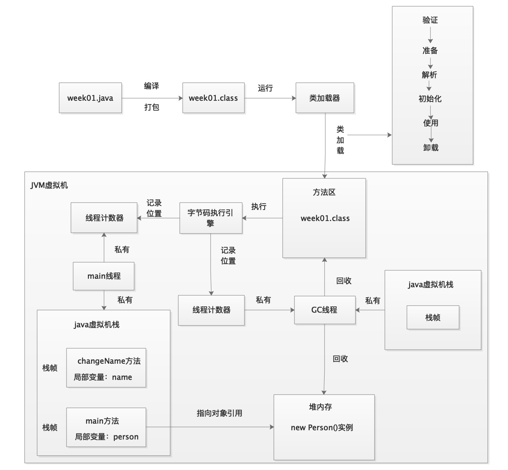

# Algorithm One

## 1.Title  
Given a 32-bit signed integer, reverse digits of an integer.

## 2.Example  
### 2.1 Example 1
    Input: 123
    Output: 321

### 2.2 Example 2
    Input: -123
    Output: -321

### 2.3 Example 3
    Input: 120
    Output: 21


## 3.Solution   

给出自己的解答和解题思路，以及leetcode上给出的解题思路

### 3.1 自己的解答,时间复杂度：O(log10(x))，空间复杂度O(log10(x))
时间和空间复杂度：比如值是100，则list的size为3，log10(10^2)+1，遍历的次数为2
```
import java.util.ArrayList;
import java.util.List;
class Solution {
    public int reverse(int x) {
         boolean flage = true;
        if(x < 0){
            x = -x;
            flage = false;
        }

        List<Integer> list = new ArrayList<>();
        int times = -1;
        double result = 0;
        while(x > 0){
            list.add(x%10);
            x = x/10;
            times++;
        }

        for(Integer integer: list){
            result = result + integer * Math.pow(10,times);
            times--;
        }
        
        if(result >= Integer.MAX_VALUE || result <= Integer.MIN_VALUE)
            return 0;
        if(! flage)
            result = -result;
        return (int)result;
    }
}
```

### 3.2 leetcode解答，时间复杂度O(log10(x))，空间复杂度O(1)
   解题思路：
    在反转过程中，可能会导致溢出情况，所以通过反推法，找出超出int类型时，除以10的次数
```
public int reverse(int x) {
        int rev = 0;
        while (x != 0) {
            int pop = x % 10;
            x /= 10;
            if (rev > Integer.MAX_VALUE/10 || (rev == Integer.MAX_VALUE / 10 && pop > 7)) return 0;
            if (rev < Integer.MIN_VALUE/10 || (rev == Integer.MIN_VALUE / 10 && pop < -8)) return 0;
            rev = rev * 10 + pop;
        }
        return rev;
    }
```

## 4.summary  
    首先没有考虑到反转后值溢出情况，其次没有想过可以通过反推找出最大的次数，需要借鉴。

# Algorithm Two

## 1.Title  

Determine whether an integer is a palindrome. An integer is a palindrome when it reads the same backward as forward.

## 2.Example  
### 2.1 Example 1
    Input: 121
    Output: true

### 2.2 Example 2
    Input: -121
    Output: false

### 2.3 Example 3
    Input: 10
    Output: false


## 3.Solution   
    给出自己的解答和解题思路，以及leetcode上给出的解题思路

### 3.1 自己的解答
解题思路：
    1）首先所有负数肯定不是水仙花数，0肯定是水仙花数  
    2）基于算法一中的反转一个数字，可以将反转后的数字和原始的数字比较，如果相等就是水仙花数  

```
 public boolean isPalindrome(int x) {
        if(x < 0 || x > Integer.MAX_VALUE || x < Integer.MIN_VALUE)
            return false;
        if(x == 0 )
            return true;
        int number = x;
        int reverseNum = 0;
        while(number > 0){
            reverseNum = reverseNum * 10 + number % 10;
            number = number/10;
        }
        if(reverseNum == x)
            return true;
        return false;
    }
```

### 3.2 leetcode 的solution，时间复杂度O(log10(n))，空间复杂度O(1）

解题思路：
    1）首先负数和个数为0且该值不为0的数都不是水仙花数.  
    2）由于数字反转后可能会超过int类型的最大值，所以只比较这个数字的一半.   
    3）如何确定在反转的过程中，已经到达数字的一半了.  
        当前半数字小于后半边数字时.  
    4）当数字个数为奇数位时，如果是水仙花数，则前半部分数字等于后半部分数字.  
       当数字个数为偶数位时，如果是水仙花数，则前半部分数字等于后半部分数字除以10.  

```
  public boolean isPalindrome1(int x) {
        if(x < 0 || (x % 10 == 0 && x != 0))
            return false;
        int revertedNumber = 0;
        while(x > revertedNumber){
            revertedNumber = revertedNumber * 10 + x % 10;
            x = x / 10;
        }
        
        return x == revertedNumber || x == revertedNumber / 10;
    }
```
## 4.summary  
    通过两种解题思路，可以看出自己忽略了转换后数字可能会超出int类型最大值，导致溢出发生，在做完算法一后没有先去看，在做第二题时还是没有考虑到这种情况；同时在考虑边界条件时，没有考虑到个位是0的数。
    

# Algorithm Three

## 1.Title  

Given a roman numeral, convert it to an integer. Input is guaranteed to be within the range from 1 to 3999.

## 2.Example  
### 2.1 Example 1
    Input: "III"
    Output: 3

### 2.2 Example 2
    Input: "IV"
    Output: 4

### 2.3 Example 3
    Input: "LVIII"
    Output: 58

注：具体什么属于roman数，详见leetcode 第13题

## 3.Solution   
    主要是给出自己的解答和浏览看到的解题思路中，觉得比较好的

### 3.1 自己的解答

```
public int romanToInt(String s){
        if(s == null || s.length() == 0) return 0;
        Map<Character,Integer> map = new HashMap<>();
        map.put('I',1);
        map.put('V',5);
        map.put('X',10);
        map.put('L',50);
        map.put('C',100);
        map.put('D',500);
        map.put('M',1000);
        int result = 0;
        char[] chars = s.toCharArray();
        int i = 0;
        while(i < chars.length - 1){
            int a = map.get(chars[i]);
            int b = map.get(chars[i+1]);
            if(result > Integer.MAX_VALUE)
                throw new IllegalArgumentException();
            if(a >= b){
                result += a;
                i++;
            }else{
                result += b - a;
                i+= 2;
            }
        }
        if(i < chars.length)
            result += map.get(chars[i]);
        return result;
    }
```

### 3.2 题友的解答一

```
  public int romanToInt1(String s)  {
       if(s == null || s.length() == 0) return 0;
       char pre = ' ';
       int res = 0;
       for(int i = 0; i<s.length(); i ++){
           res = countResult(res,pre,s.charAt(i));
           pre = s.charAt(i);
       }
       return res;
    }

    private int countResult(int result, char pre, char current) {
        if(pre == 'I' && current == 'V') return result - 1 + 4;
        if(pre == 'I' && current == 'X') return result - 1 + 9;
        if(pre == 'X' && current == 'L') return result - 10 + 40;
        if(pre == 'X' && current == 'C') return result - 10 + 90;
        if(pre == 'C' && current == 'D') return result - 100 + 400;
        if(pre == 'C' && current == 'M') return result - 100 + 900;
        if(current == 'I') return result + 1;
        if(current == 'V') return result + 5;
        if(current == 'X') return result + 10;
        if(current == 'L') return result + 50;
        if(current == 'C') return result + 100;
        if(current == 'D') return result + 500;
        if(current == 'M') return result + 1000;
        return 0;
    }
```

### 3.2 题友的解答二

    这个解答，考虑到罗马数中不会出现IXIX这种情况，个人觉得很赞，这是对罗马数的表示和对题理解得很深刻才会想到的

```
     public int romanToIntTwo(String s)  {
        if(s == null || s.length() == 0) return 0;
        Map<Character,Integer> map = new HashMap<>();
        map.put('I',1);
        map.put('V',5);
        map.put('X',10);
        map.put('L',50);
        map.put('C',100);
        map.put('D',500);
        map.put('M',1000);
        int result = 0;
        for(int i = 0;i<s.length();i++){
            result += map.get(s.charAt(i));
        }
        if(s.contains("IV") || s.contains("IX")) result -= 2;
        if(s.contains("XL") || s.contains("XC")) result -= 20;
        if(s.contains("CD") || s.contains("CM")) result -= 200;

        return result;
    }
```
## 4.summary 
    虽然自己做出了这道题，但是通过后面两种解答，可以看出自己并没有完成理解罗马数的概念，后面需要加强对题目的理解。

# Review
    这周看了什么是servlet以及servlet容器，servlet是由servlet容器管理，并且可以动态生成内容的一种java技术。
    servlet容器也可以叫做servlet引擎，用来管理servlet，并控制servlet的生命周期，并且所有的servlet容器都必须支持HTTP/1.0和HTTP/1.1。


# Tip
这次分享自己学习后，根据简单的代码画出的整体jvm运行图,代码如下：
```
public class Week01 {
    public static void main(String[] args) {
        Person person = new Person();
        person.changeName("little Tom");
    }
}

public class Person {

    public String name;//类变量
    
    public String getName() {
        return name;
    }
    
    public void changeName(String changeName){
        String name = getName();
        if(name.equals("Tom")){
            this.name = changeName;
        }
    }
}
```
JVM运行图如下：  


# Share
[IntelliJ IDEA 快捷键终极大全](https://mp.weixin.qq.com/s/lgc6qowPvl0uJXAZJ0zawg)  
[IntelliJ IDEA 常用快捷键 - Mac版本](https://mp.weixin.qq.com/s/PVnJX9XpQ5L6XMIZshvyYA)
